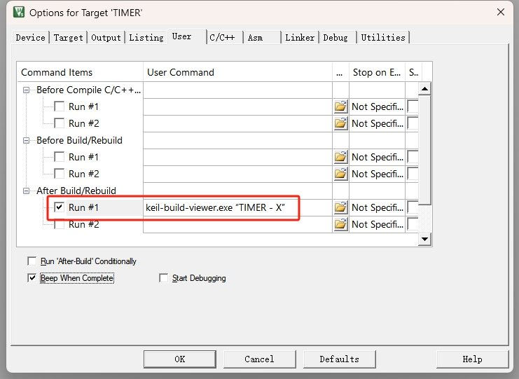

# keil-build-viewer v1.4


## 1 介绍
这是一个 keil 的编译信息查看器，是对 keil 编译信息展示的增强工具。具备以下功能：
1.  解析参与编译的每个文件对 RAM 和 flash 的占用情况
    - 自动忽略不被包含进编译的文件
    - 自动检索被 keil 改名的文件
    - **支持双击打开文件**
    - 支持关闭该信息的展示
    - 支持仅显示文件名

2.  分析芯片的 RAM 和 flash 的使用情况，使用进度条可视化展示
    - `■` 表示实际占用的区域
    - `□` 表示 zero initialize 的区域
    - `_` 表示未被使用的区域

3.  二次编译后新增与减少的数据量展示
    - 通过对比上次的编译结果，**显示本次编译新增或减少的数据量大小，单位是 byte**
    - 若是新增的文件，则会显示 `[NEW]`

4.  自动搜索本级目录的 keil 工程，因此可无参调用
    - 默认选择搜索到的最后一个 keil 工程
    - 支持输入绝对路径指定 keil 工程
    - 支持仅输入文件名指定 keil 工程（必须是同级目录，可不带文件扩展名）
    - **若路径或工程名有空格，则使用 `""` 括起来**

5.  支持输入参数修改选项
    - 如第 4 功能所描述的，指定 keil 工程
    - `-OBJ`     显示每个文件的 RAM 和 flash 的占用信息（默认）
    - `-NOOBJ`   不显示每个文件的 RAM 和 flash 的占用信息
    - `-PATH`    显示每个文件的相对路径（默认）
    - `-NOPATH`  仅显示每个文件的文件名
    - **以上命令不区分大小写**

6.  显示最大的栈使用
    - 数据来自 keil ，静态无法精确分析，数据仅供参考

7.  支持放置于公共目录后，可在任意目录调用本工具，无需跟随 keil uvproj(x) 工程
    - v1.4 新增功能
    - **必须设置好系统环境变量，并把 `keil-build-viewer.exe` 放置于系统环境变量所指定的目录中**，建议使用系统环境变量 `Path`
    - 可节省拷贝 `keil-build-viewer.exe` 至对应 keil uvproj(x) 工程的步骤，但 `after build` 仍需填写，详见 `2 在 keil 中使用`

> **说明：** 本工具的所有参数可不按顺序输入，为空时表示选择默认值，但参数与参数之间需用**空格**隔开

> **双击打开对应文件动画演示**


## 2 在 keil 中使用
1.  在 keil 中调用方式很简单，下载发行版中的 `keil-build-viewer.exe` 放在 keil 对应的 uvproj(x) 工程的同级目录，按下图进行配置即可。如需输入其他选项，则在 `keil-build-viewer.exe` 后跟随输入。如仅显示每个文件的文件名，则可填写：<br>
    ```
    keil-build-viewer.exe -NOPATH
    ```

2.  在 cmd 或 powershell 中使用同理，仅需添加前缀 `.\` 即可。如：<br>
    ```
    .\keil-build-viewer.exe
    ```


## 3 我想自己编译这个工具
**本代码仅支持 windows 系统**
### 3.1 预备操作
0.  如果你已经安装了 gcc ，请忽略本步骤
1.  下载 gcc 编译器，为了考虑兼容性，这里提供一个 32 位的 mingw 下载链接： [i686-13.1.0-release-posix-dwarf-ucrt-rt_v11-rev1.7z](https://github.com/niXman/mingw-builds-binaries/releases/download/13.1.0-rt_v11-rev1/i686-13.1.0-release-posix-dwarf-ucrt-rt_v11-rev1.7z)
2.  解压后放在任意路径，此处以 `C:\mingw32` 为例
3.  配置好环境变量
    

4.  打开 `powershell` 或 `cmd` 输入 `gcc -v` ，出现下图内容表示配置成功
    

### 3.2 编译
1.  打开 `powershell` 或 `cmd` 并定位至代码目录
    - 若使用 `powershell` ，可在代码目录空白处按住 `shift` 键同时单击鼠标右键选择打开 `powershell` ，将自动定位到代码目录

2.  执行以下 gcc 命令
    ```
    gcc .\keil-build-viewer.c -o .\keil-build-viewer.exe
    ```
3.  无任何提示信息，编译通过
    


## 4 问题解答
1.  出现 `[ERROR] NO keil project found` 之类的提示
    > 确认 `keil-build-viewer.exe` 放在了你需要查看的 keil uvproj(x) 工程同级目录

2.  出现 `[ERROR] listing path is empty` 之类的提示
    > 在 keil 中选择你要放置的 listing 相关文件的文件夹
    

3.  出现 `[ERROR] generate map file is not checked` 或 `[ERROR] Check if a map file exists` 之类的提示
    > 确认 keil 已经勾选了下图这些选项
    

4.  若编译信息缺失或与实际有偏差
    > 确认解析的工程为目标工程（同级目录存在多个工程时）<br>
    > 可通过解析出的前置信息核对当前工具所解析的工程，若发现不一致，可在 `keil-build-viewer.exe` 之后指定工程名，如：
    ```
    keil-build-viewer.exe TIMER
    或
    keil-build-viewer.exe TIMER.uvprojx
    ```
    > 

5.  若工程目录或工程名有空格，将其使用 `""` 括起来
    > 

6.  其他问题请提 issues 或联系作者。


## 修改记录
| 版本 |     日期    |修改者        |修改内容                                            |
|:----:|:----------:|--------------|---------------------------------------------------|
| v1.0 | 2023-11-10 | Dino         | 初版发布                                           |
| v1.1 | 2023-11-11 | Dino         | 1. 适配 RAM 和 ROM 的解析                          |
| v1.2 | 2023-11-11 | Dino         | 1. 适配 keil4 的 map 文件<br>2. 增加检测到开启 LTO 后打印提示信息<br>3. 修复开启 LTO 后无打印 region 的问题  |
| v1.3 | 2023-11-12 | Dino         | 1. 修复工程存在多个 lib 时仅解析一个的问题           |
| v1.4 | 2023-11-21 | Dino         | 1. 增加将本工具放置于系统环境变量 Path 所含目录的功能 |

## 重要说明
> **1. 目前仅支持 keil MDK。**
>
> **2. 不支持解析通过 RTE 添加的文件**


## 参与贡献

1.  Fork 本仓库
2.  新建 Feat_xxx 分支
3.  提交代码
4.  新建 Pull Request

